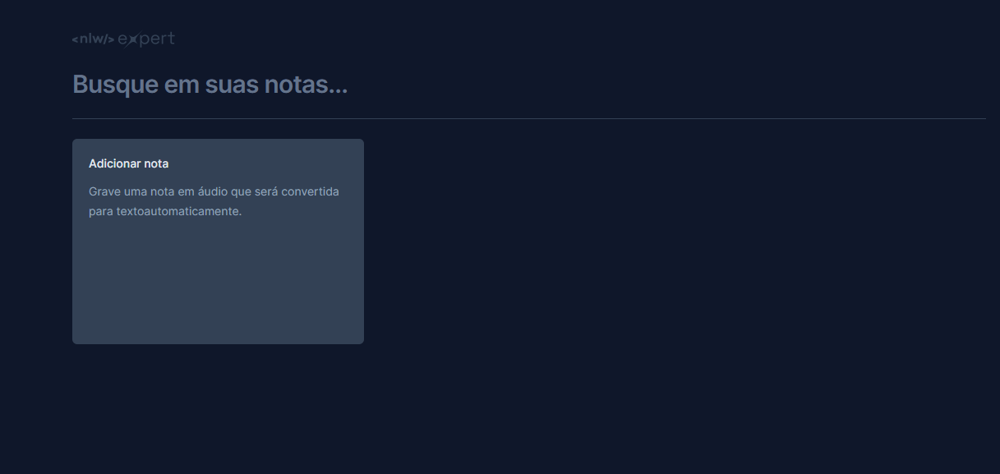
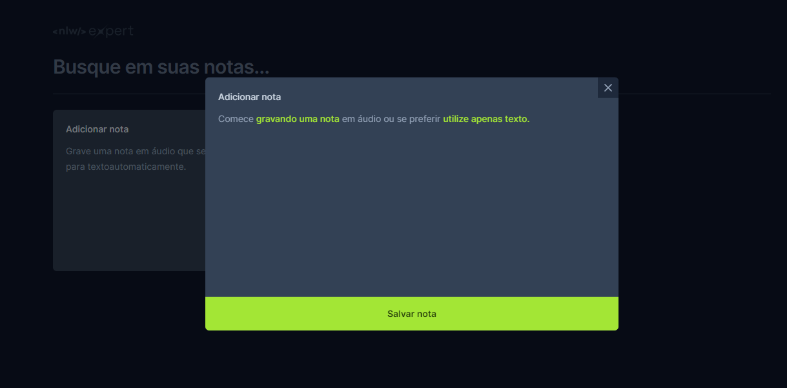
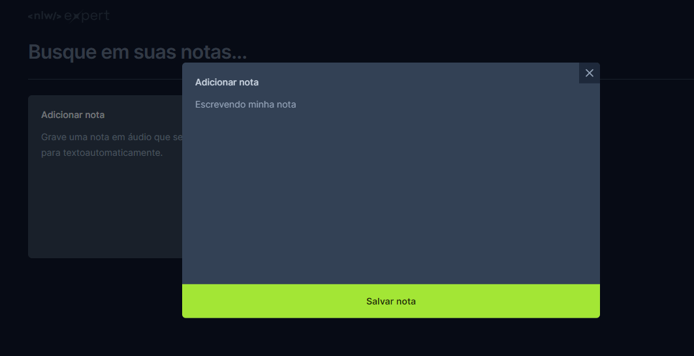
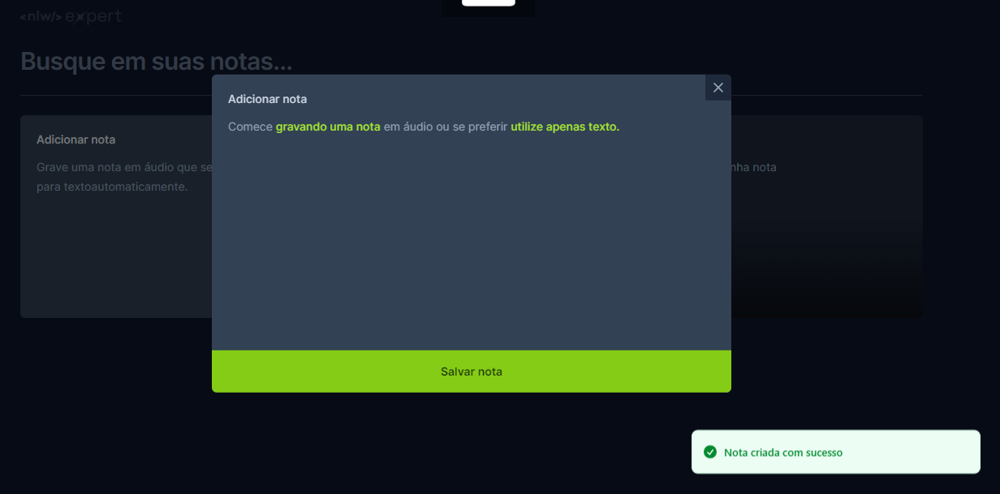
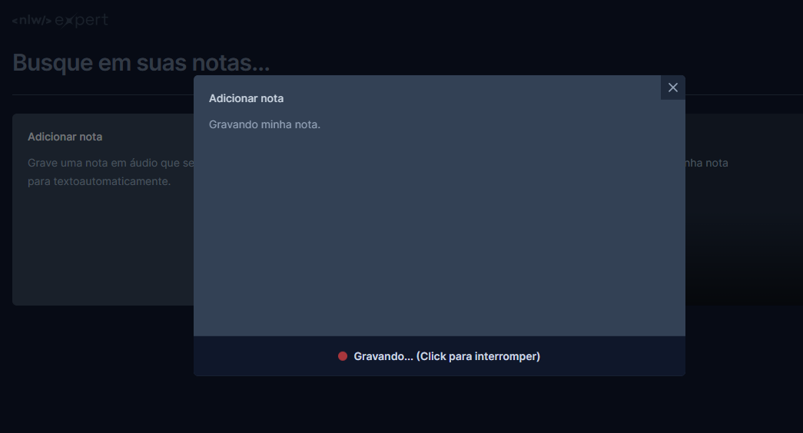
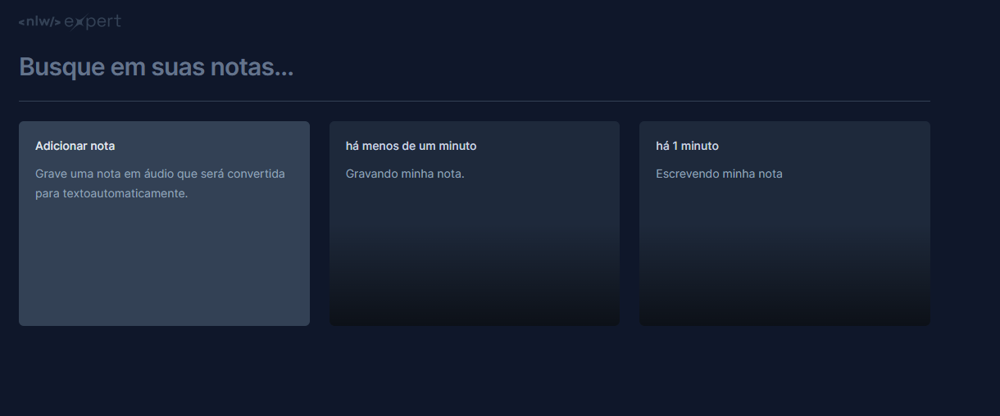
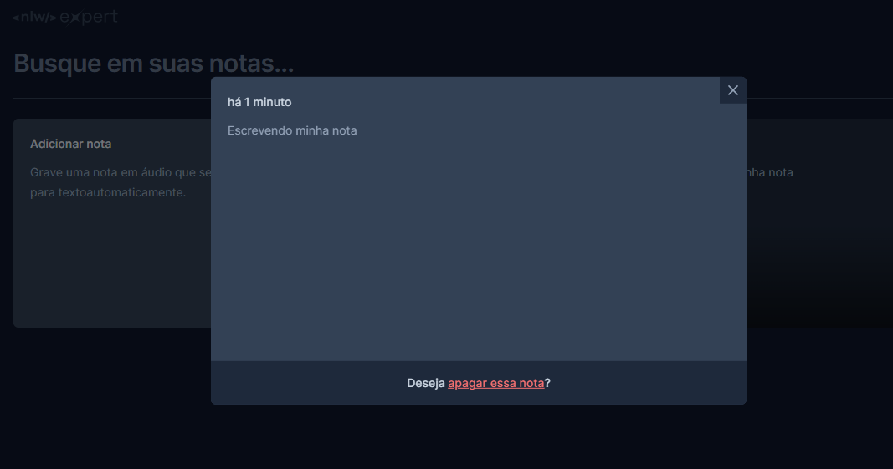

<h1 align="center">NLW Expert React</h1>

PÁGINA INICIAL: Deve clicar em adicionar nota

PÁGINA ONBOARDING: Escolhe adicionar nota digitando ou gravando audio

PÁGINA UTILIZANDO TEXTO: Digite a nota

SALVAR NOTA: A nota será salva e armazenada na pagina inicial

PÁGINA DE GRAVAÇÃO DA NOTA: Sua nota será transcrita através do audio

PÁGINA INICIAL: Veja todas as notas criadas

PÁGINA DE VISUALIZAÇÃO E DELETAR NOTA: Pode visualizar a nota e optar por deleta-la

<a href=""> Teste a aplicação</a>

Projeto desenvolvido durante a Next Level Week (NLW) - Trilha React. Este projeto utiliza a API SpeechRecognition para converter o áudio do usuário em notas. Além disso, implementa o conceito de Lifting State Up para o gerenciamento de notas e a persistência dos dados utilizando o LocalStorage.

<h2>Tecnologias Utilizadas</h2>
<ul>
  <li>TypeScript</li>
  <li>React</li>
  <li>Vite</li>
  <li>Tailwind CSS</li>
  <li>Sonner</li>
  <li>Radix UI</li>
  <li>Crypto randomUUID</li>
  <li>SpeechRecognition</li>
</ul>

<h2>Funcionalidades Principais</h2>
<ul>
  <li>Transformação de áudio em notas usando SpeechRecognition.</li>
  <li>Gerenciamento de estado usando o conceito de Lifting State Up.</li>
  <li>Persistência de dados utilizando o LocalStorage.</li>
</ul>
<h2>Contribuição</h2>

Sinta-se à vontade para contribuir com melhorias, correções de bugs ou novas funcionalidades. Abra uma issue ou envie um pull request.

<h2>Licença</h2>

Este projeto está sob a licença <a href="LICENSE">MIT</a>.

